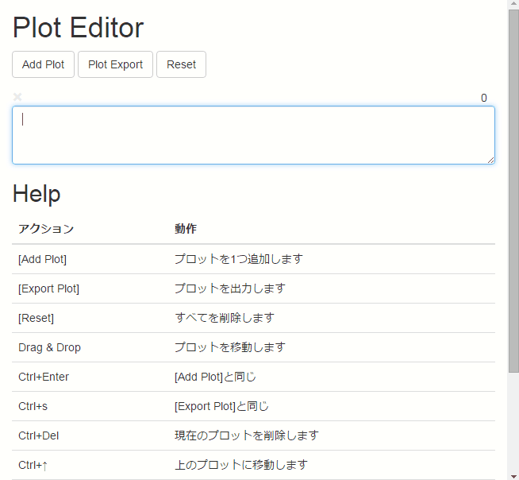

Plot Editor
===

文章や歌詞を書くときに使えるプロットエディタです。

使用ライブラリ
---

* Vue.js 0.12.8
* Sortable.js
* Bootstrap 3.3.5

使い方
---

|アクション|動作|
| --- | --- |
|「Add Plot」|プロットを1つ追加します|
|「Export Plot」|プロットを出力します|
|「Reset」|すべてを削除します|
|Drag & Drop|プロットを移動します|
|Ctrl+Enter|「Add Plot」と同じ|
|Ctrl+s|「Export Plot」と同じ|
|Ctrl+Del|現在のプロットを削除します|
|Ctrl+↑|上のプロットに移動します|
|Ctrl+↓|下のプロットに移動します|
|Ctrl+Shift+↑|上のプロットと入れ替えます|
|Ctrl+Shift+↓|下のプロットと入れ替えます|

&copy; 2015 [Black Everyday Company](http://kuroeveryday.blogspot.com/)
